# Làm việc với git
@author: @Vinhdev04 
---
## 📜 Xem lịch sử commit
- **git log**: Xem chi tiết toàn bộ lịch sử commit
- 👉 Hiển thị đầy đủ: commit ID, author, ngày, message
```
    git log
```
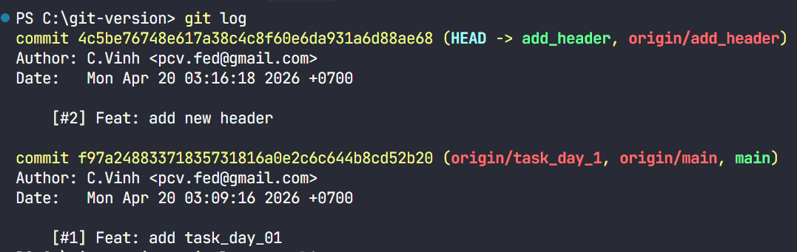
---
- **git log --oneline**: Xem nhanh, mỗi commit 1 dòng
- 👉 Dễ đọc, gọn nhẹ
```
    git log --oneline 
```
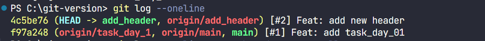
---

---
- **git log --oneline -n5**: Xem 5 commit gần nhất
- 👉 Dễ đọc, gọn nhẹ
```
    git log --oneline 
```
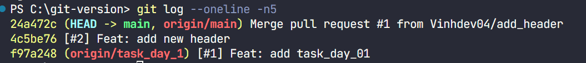
---

- **git log --oneline --graph**: Hiển thị dạng cây (branch)
- 👉 Giúp thấy rõ nhánh, merge, HEAD
```
    git log --oneline --graph --decorate --all 
```
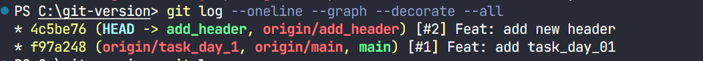
---
- **git log -p**: Xem chi tiết thay đổi code trong từng commit
- 👉 Hiển thị diff (code thay đổi)
```
    git log -p
```
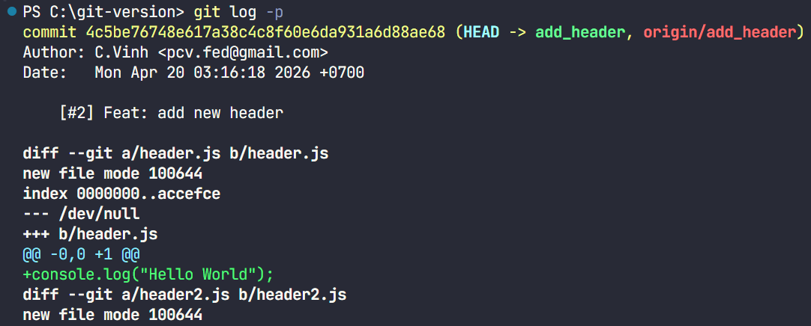
---
- **git log file_name**: Xem lịch sử của 1 file
```
    git log file_name
```
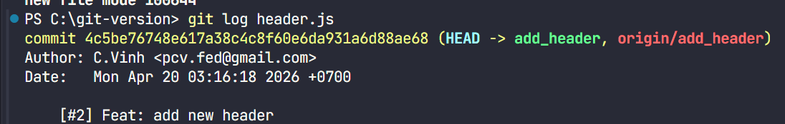
---
- **git log --author=author_name**: Lọc commit theo người tạo
```
    git log --author=author_name
```
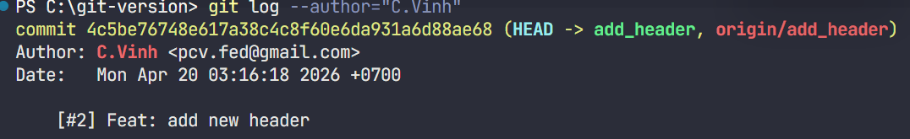
---
- **git log --since=date**: Lọc theo thời gian
```
    git log --since=date
```
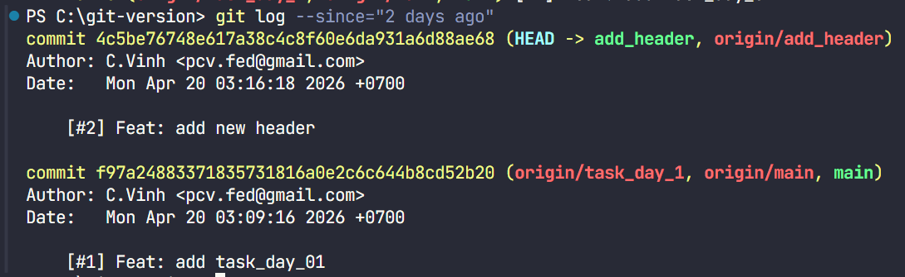
---
- **git commit --amend**: Sửa commit gần nhất
- 👉 Dùng khi:
    + sửa message
    + thêm/bớt file đã commit
- ⚠️ Commit sẽ bị đổi ID (hash)
```
    git commit --amend
```
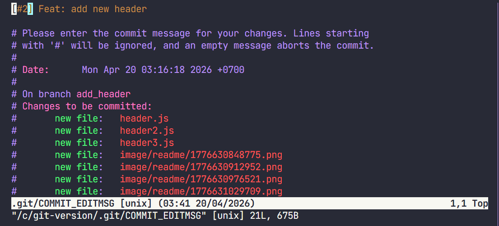
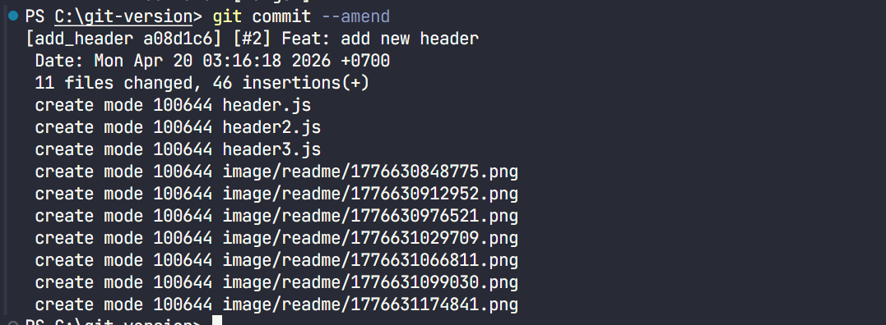
---
**git push origin add_header  -f**: Ghi đè lịch sử trên remote
- 👉 Dùng khi đã --amend hoặc rebase
- ⚠️ Cẩn thận:
    + Có thể ghi đè commit của người khác
- ✅ Khuyến nghị dùng an toàn hơn: `git push --force-with-lease`

```
    git push origin add_header  -f
```
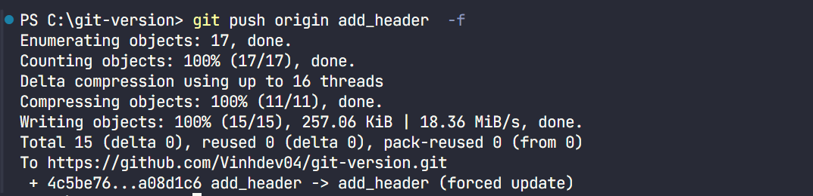
---
**git diff**: git diff là lệnh dùng để `so sánh sự khác nhau (diff) giữa các phiên bản file trong Git.`
- 👉 Nói đơn giản: nó cho bạn biết bạn đã thay đổi gì trong code.
```
    git diff
```
- 👉 Hiển thị thay đổi giữa working directory và staging area
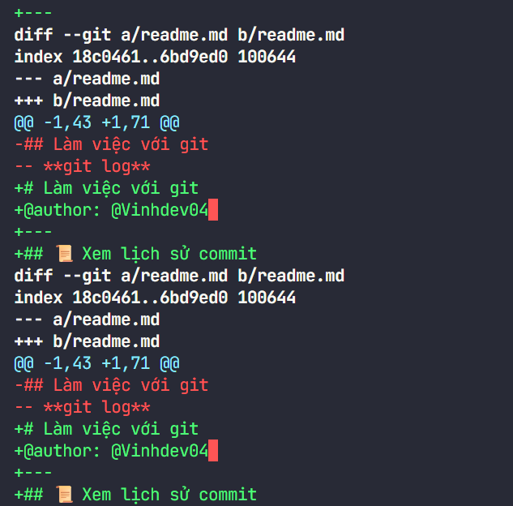
-   🧠 Cách hoạt động
    -   So sánh giữa:
        -   file hiện tại (working directory)
        -   với phiên bản đã được lưu trong Git (commit hoặc staging)
**git diff**→ xem thay đổi chưa add
**git diff --staged** → xem thay đổi đã add
**git diff commit1 commit2** → so sánh 2 commit
**git pull**: Lấy lịch sử từ remote
- 👉 Dùng khi:
    + có commit mới trên remote
    + muốn cập nhật local
```
    git pull
```
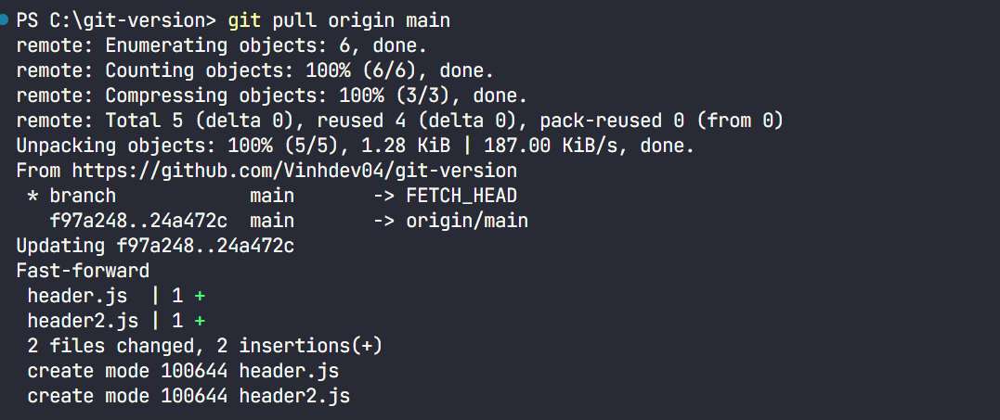
---
**git fetch**: git fetch dùng để lấy (download) các thay đổi mới từ remote (ví dụ GitHub) về máy nhưng KHÔNG tự động merge vào code hiện tại.
- 👉 Nói đơn giản: fetch = cập nhật thông tin mới, nhưng chưa đụng vào code bạn đang làm
```
    git fetch
```
---
**git reflog**: lịch sử hành động trong repo (kể cả những commit đã bị mất)
```
    git reflog
```
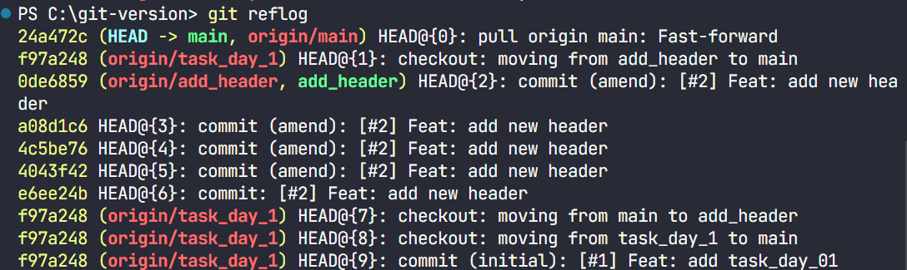
--- 
**git reflog --no-abbrev**: `Mặc định Git hiển thị commit ID dạng rút gọn (ví dụ: a1b2c3d)`
- 👉 no-abbrev → `hiển thị full commit hash (đầy đủ 40 ký tự)`
```
    git reflog --no-abbrev
```

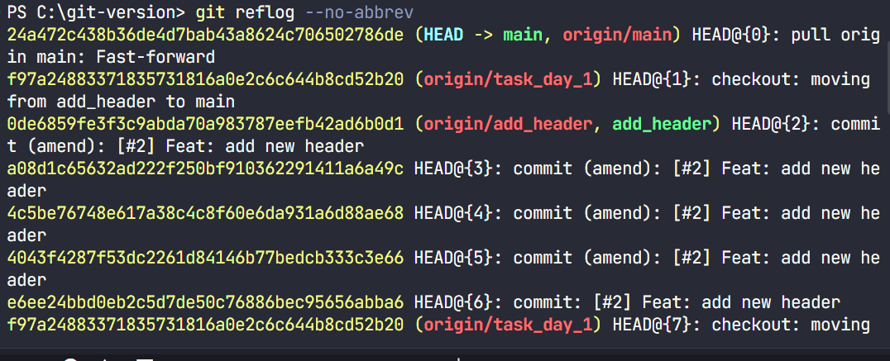
-   🧠 Khi nào dùng?
    -   Khi cần copy chính xác commit hash đầy đủ
    -   Khi làm việc với:
        - git reset
        - git checkout
        - recovery (khôi phục commit bị mất)

---